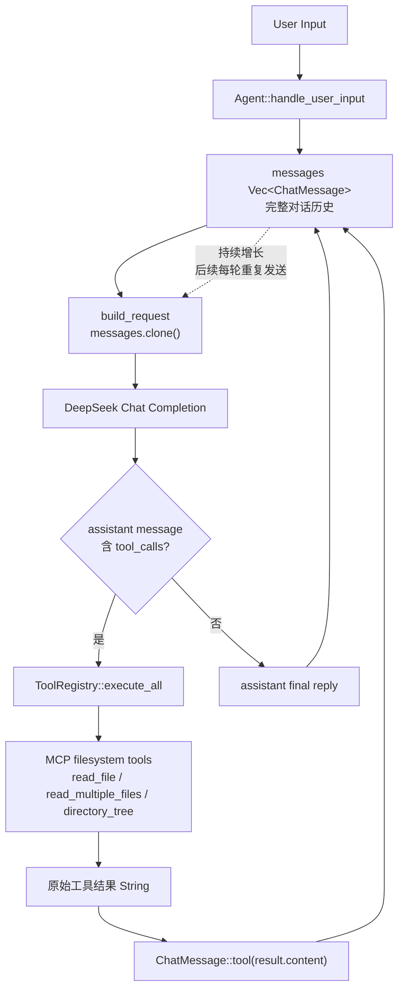
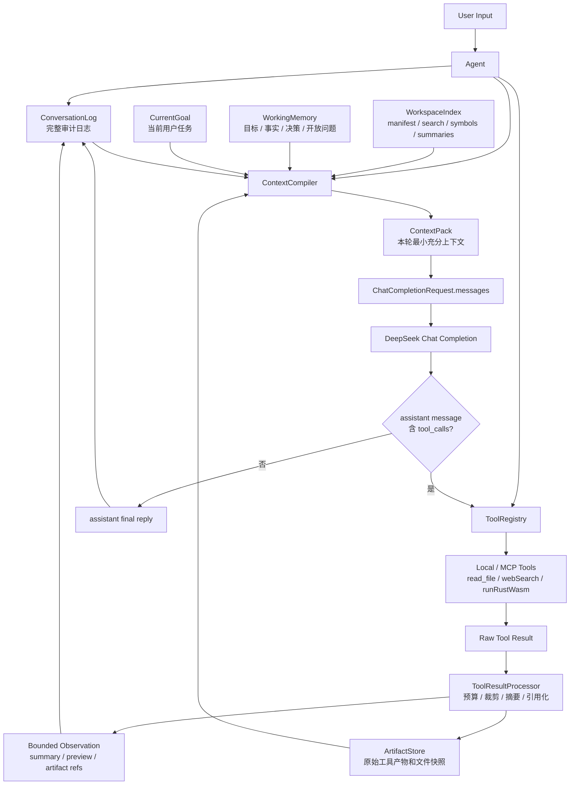

# Sparrow Agent 上下文窗口治理方案

状态：建议方案
日期：2026-05-06
适用项目：`sparrow_agent`

## 1. 背景

Sparrow 已经接入 filesystem MCP tools。用户让 Agent “理解项目”时，模型很自然会连续调用 `read_file`、`read_multiple_files`、`directory_tree`、`search_files` 等工具。当前实现会把工具结果作为 `tool` 消息原样追加到对话历史，下一轮请求又把完整 `messages` 克隆并发送给模型。

这会产生一个结构性问题：一次大文件读取不仅占用当前轮上下文，还会在后续每一轮持续占用上下文。多文件读取时，模型越想理解项目，越容易把上下文窗口塞满，最后出现溢出、响应变慢、成本增加、注意力被低价值文本稀释等问题。

## 2. 当前调用链分析

当前关键路径如下：

```text
Agent::handle_user_input
  -> build_request()
      -> messages.clone()
      -> tool_registry.definitions()
  -> DeepSeek chat completion
  -> handle_assistant_message()
      -> tool_registry.execute_all(tool_calls)
      -> ChatMessage::tool(result.content, tool_call_id)
      -> 继续下一轮
```

现状中的主要事实：

- `Agent` 用一个增长型 `Vec<ChatMessage>` 维护完整历史。
- 每轮请求都会发送完整历史，而不是发送经过预算压缩后的上下文包。
- MCP filesystem 工具结果通过 `McpClient::call_tool(...)` 和 `ToolCallResult::to_text()` 转成普通字符串。
- `McpToolProvider` 目前做了路径校验和写入确认，但没有对读取结果做实际的大小裁剪、分片或摘要。
- `FilesystemConfig` 已有 `max_read_bytes`、`max_write_bytes` 字段，但读取输出限制尚未成为统一执行策略。
- `read_multiple_files`、`directory_tree`、搜索结果、网页搜索结果、编译输出等都可能成为大体量工具输出。问题不只属于 `read_file`。

## 3. 根因

根因不是某个文件太大，而是架构把“外部世界的原始数据”直接当成“模型长期记忆”。

具体表现：

- 工具输出没有生命周期管理：进入 `messages` 后会一直保留。
- 工具输出没有上下文预算：结果大小由工具/server 决定，而不是由 Agent 统一调度。
- 工具输出没有结构化索引：模型只能靠继续读取更多全文来定位信息。
- 对话历史没有编译过程：发送给模型的内容等同于历史日志，而不是面向当前任务的最小充分上下文。
- 没有区分短期可见上下文、长期可引用资料、持久项目索引和最终答复记忆。

因此，仅增加 `max_read_bytes` 或提示模型“少读文件”只能缓解，不能根治。根本方案必须让 Agent Host 接管上下文，而不是让模型自己用工具结果填满上下文。

## 4. 总体目标

本方案目标是建立一套通用的上下文治理层：

- 任何工具输出都必须经过统一的预算、裁剪、摘要、引用化处理。
- 文件内容不再默认长期塞入聊天历史。
- 模型可以通过稳定引用继续请求某个文件、范围、搜索命中或工具产物。
- Agent 每轮请求前编译一个“上下文包”，只包含当前任务需要的最小充分内容。
- 支持项目理解类任务的渐进式探索：先索引和检索，再按需读取局部，再总结成工作记忆。
- 当上下文接近阈值时自动压缩，而不是等模型接口报错。
- 对 `read_file`、`webSearch`、`runRustWasm`、MCP tools 等所有工具使用同一套治理策略。

## 5. 核心设计原则

### 5.1 工具输出引用化

工具执行结果不应默认完整进入 `messages`。工具层返回给模型的是一个有预算的 observation：

```text
Observation
  summary: 人类和模型可读的短摘要
  preview: 小片段或命中列表
  artifacts: 可继续引用的结果句柄
  next_actions: 建议的继续读取方式
  budget: 原始大小、已注入大小、是否截断
```

原始内容保存在 Host 管理的 `ArtifactStore` 中：

```text
artifact://tool/{call_id}
artifact://file/{path_hash}
artifact://file/{path_hash}#L120-L180
artifact://search/{query_hash}
```

模型后续需要细节时，不是要求重新读全文，而是请求某个 artifact 的局部范围。

### 5.2 上下文编译器

每轮请求前不再直接 `messages.clone()`。Agent 应引入 `ContextCompiler`：

```text
ConversationLog + WorkingMemory + ArtifactStore + CurrentGoal
  -> ContextCompiler
      -> TokenBudget
      -> SelectedContextPack
  -> ChatCompletionRequest.messages
```

`ConversationLog` 是完整审计日志，可以很大；`SelectedContextPack` 是本轮真正发送给模型的有限上下文。

### 5.3 渐进式项目理解

项目理解的默认路径应从“读取全文”改为“建立地图 -> 检索 -> 局部读取 -> 摘要沉淀”：

```text
repo_map
  -> file_manifest
  -> symbol_index / text_search
  -> targeted file slices
  -> module summaries
  -> task-specific context pack
```

模型应该优先拿到目录结构、文件类型、入口点、依赖图、符号命中和短摘要。只有在需要验证具体行为时才读取局部代码。

### 5.4 统一预算

预算必须是 Host 侧硬约束，而不是提示词约束。

建议默认预算：

| 类型 | 默认上限 | 说明 |
| --- | ---: | --- |
| 单个工具 observation | 8 KiB 文本或约 2k tokens | 直接进模型的工具结果 |
| 单文件预览 | 4 KiB 文本 | 默认 head 或相关片段 |
| 单次多文件读取 | 16 KiB 文本 | 每个文件摘要加少量片段 |
| 目录树 | 1,000 个节点或 16 KiB | 超限返回折叠树和统计 |
| 搜索结果 | 50 条命中 | 每条含路径、行号、短片段 |
| 本轮上下文包 | 模型窗口的 60% | 留出推理和工具调用空间 |
| 历史摘要触发阈值 | 模型窗口的 40% | 提前压缩，不等溢出 |

这些数值应可配置，但默认必须安全。

## 6. 目标架构

### 6.1 改造前架构



改造前的核心问题是 `messages` 同时承担审计日志、工作记忆和模型请求上下文三种角色。工具原始结果一旦进入 `messages`，就会在后续每一轮重复进入 prompt。

### 6.2 改造后架构



改造后，完整历史和原始工具结果仍可审计、可引用，但不再默认进入模型上下文。每轮真正发送给模型的是 `ContextCompiler` 在预算内编译出的 `ContextPack`。

### 6.3 模块边界

新增模块建议：

| 模块 | 职责 |
| --- | --- |
| `context_budget.rs` | token/byte 预算、阈值和裁剪策略 |
| `artifact_store.rs` | 保存工具原始结果、文件快照、搜索结果，返回稳定引用 |
| `tool_result_processor.rs` | 将任意工具结果转为 bounded observation |
| `workspace_index.rs` | 文件清单、忽略规则、符号/文本索引、文件摘要 |
| `working_memory.rs` | 长对话压缩后的目标、事实、决策、开放问题 |
| `context_compiler.rs` | 每轮选择哪些历史、摘要、片段、artifact 进入请求 |

## 7. 工具协议改造

### 7.1 文件读取工具

不推荐让模型直接无限制调用“读取完整文件”。应将文件工具能力拆成以下层次：

| 工具 | 用途 | 返回 |
| --- | --- | --- |
| `inspect_file` | 获取元数据 | 路径、大小、类型、行数、hash、是否过大 |
| `read_file_slice` | 读取指定范围 | 行号范围或 byte range |
| `search_in_file` | 文件内检索 | 命中行、短片段 |
| `summarize_file` | 生成或获取文件摘要 | 模块职责、关键类型、函数列表 |
| `read_file` | 兼容入口 | 小文件返回全文，大文件返回摘要和下一步建议 |
| `read_multiple_files` | 批量摘要 | 默认不返回多个全文 |

兼容 MCP filesystem server 时，可以在 Sparrow 侧包装这些能力：模型看到的是安全工具，底层再调用 MCP 的 `read_file` 或 `read_multiple_files`。

### 7.2 目录和搜索工具

`directory_tree` 必须支持折叠和分页：

- 返回根目录下的高层结构。
- 对 `target/`、`.git/`、`node_modules/`、二进制产物默认忽略。
- 超限时返回统计和“可展开目录引用”，而不是完整 JSON。

`search_files` 应返回命中列表，不返回大段文件内容：

```text
src/agent.rs:152 build_request(...)
src/agent.rs:191 ChatMessage::tool(...)
```

模型需要细节时再读取对应行附近窗口。

### 7.3 非文件工具

同一规则也适用于其他工具：

- `webSearch`：保存完整搜索结果，默认只注入前若干条摘要。
- `runRustWasm`：stdout/stderr 超限时保存 artifact，注入摘要和尾部错误。
- MCP resource/image/audio：默认注入元数据，不注入 base64 或大文本。

## 8. 消息历史改造

当前 `messages` 同时承担审计日志和模型上下文，这是溢出的核心。建议拆分为三层：

| 层 | 是否完整保存 | 是否每轮发送 | 内容 |
| --- | --- | --- | --- |
| `ConversationLog` | 是 | 否 | 用户输入、助手回复、工具调用、工具原始结果引用 |
| `WorkingMemory` | 是 | 是，预算内 | 当前任务目标、重要事实、决策、文件摘要 |
| `ContextPack` | 否，临时生成 | 是 | 本轮选择后的系统提示、近期对话、必要片段 |

工具消息进入 `ConversationLog` 时只记录：

```json
{
  "role": "tool",
  "tool_call_id": "...",
  "content": "Read src/agent.rs: 9.4 KiB, 260 lines. Stored as artifact://file/abc123. Preview: ...",
  "artifact_refs": ["artifact://file/abc123"]
}
```

原始文件内容保存在 `ArtifactStore`，由 `ContextCompiler` 决定是否取片段进入本轮上下文。

## 9. 自动压缩策略

上下文压缩不是异常恢复，而是常规流程。

建议引入三类压缩：

### 9.1 对话压缩

当历史超过阈值时，把旧对话压成 `WorkingMemory`：

- 用户长期目标。
- 已确认事实。
- 已做决策。
- 已读文件及其摘要。
- 未解决问题。
- 最近工具 artifact 引用。

压缩后，旧消息留在审计日志，但不再逐条发送。

### 9.2 文件摘要

文件第一次被读取或索引时生成摘要：

- 文件职责。
- 主要结构体、函数、trait。
- 对外接口。
- 与其他模块关系。
- 风险点或 TODO。

摘要必须带文件 hash。文件 hash 变化后摘要失效。

### 9.3 任务包压缩

每个用户任务结束时，生成一个短 task summary：

- 用户问了什么。
- 最终结论或改动。
- 关键文件。
- 后续建议。

这样下一轮不需要保留完整推理过程和全部工具输出。

## 10. 模型行为约束

系统提示词和工具描述要明确引导探索策略，但这只是第二道防线。

建议加入以下规则：

- 理解项目时先调用目录/搜索/摘要工具，不要批量读取全文。
- 读取文件优先使用 `read_file_slice`、`search_in_file`、`summarize_file`。
- 只有小文件或用户明确要求全文时才读取完整文件。
- 每次读取前说明需要验证的问题。
- 已有 artifact 或摘要时优先复用，不重复读取同一内容。
- 如果工具返回“截断/需要范围”，按建议继续局部读取。

这些规则应写入 tool description 和 system prompt，但必须由 Host 的预算策略兜底。

## 11. 分阶段实施计划

### 阶段 0：观测和基线

任务：

- 统计每轮 `messages` 总字节数、估算 token 数、工具结果字节数。
- 在 debug 日志中记录每个工具结果大小和是否进入上下文。
- 加一组复现脚本：让 Agent 总结仓库、读取多个文件、生成目录树。
- 明确当前溢出阈值和典型 token 增长曲线。

验收：

- 能看到一次项目理解任务中每轮上下文增长。
- 能定位最大的工具输出来源。
- 不改变现有用户行为。

### 阶段 1：硬性输出闸门

任务：

- 实现 `ToolResultProcessor`。
- 对所有工具结果设置默认 observation 上限。
- 对超限结果返回摘要、预览、截断提示和 artifact 引用。
- 实际启用 `FilesystemConfig.max_read_bytes`。
- 对 `read_multiple_files`、`directory_tree`、`search_files` 加总量限制。

验收：

- 单次工具结果无法超过配置的注入上限。
- 大文件读取不会把完整文件塞进 `messages`。
- 模型能根据返回提示继续请求 `head`、`tail` 或行号范围。

### 阶段 2：ArtifactStore

任务：

- 新增内存版 `ArtifactStore`。
- 工具原始结果、文件快照、搜索结果保存为 artifact。
- observation 中返回 artifact id、大小、hash、可读取范围。
- 新增 `read_artifact_slice` 或等价内部工具。

验收：

- 模型看到的是短 observation，但仍可按引用读取细节。
- 同一文件重复读取可复用 artifact。
- artifact 不进入配置文件，不长期泄露敏感内容。

### 阶段 3：上下文编译器

任务：

- 将 `Agent.messages` 拆成 `ConversationLog` 和本轮 `ContextPack`。
- 实现 `ContextCompiler`，按预算选择：
  - system prompt
  - 当前用户请求
  - 最近少量对话
  - working memory
  - 必要 artifact 片段
  - 必要工具调用占位消息
- 当上下文超阈值时自动压缩旧消息。

验收：

- `ChatCompletionRequest.messages` 不再等于完整历史。
- 长会话中 prompt token 增长趋于稳定。
- 工具调用协议仍能满足模型 API 对 tool call/result 顺序的要求。

### 阶段 4：WorkspaceIndex

任务：

- 建立文件 manifest：路径、大小、mtime、hash、语言、是否忽略。
- 遵循 `.gitignore` 和 deny patterns。
- 提供文本搜索和符号搜索。
- 为源码文件生成缓存摘要。
- 增加 `repo_map`、`find_symbol`、`summarize_file` 等高层工具。

验收：

- 项目理解任务默认先走索引和摘要。
- 总结仓库不需要读取所有源码全文。
- 文件变化后对应摘要和索引自动失效。

### 阶段 5：工作记忆和长任务压缩

任务：

- 新增 `WorkingMemory` 数据结构。
- 每次任务结束或阈值触发时更新工作记忆。
- 记录已读文件摘要、关键决策、开放问题和 artifact 引用。
- 为用户提供 `/context`、`/memory` 一类调试命令。

验收：

- 长任务不会因为历史过长而丢失关键目标。
- 用户可以查看当前 Agent 认为重要的上下文。
- 旧工具结果不再重复发送，但结论仍能延续。

### 阶段 6：评测和回归保护

任务：

- 构造大仓库 fixture。
- 加入“理解项目”“定位函数”“跨文件修改计划”等任务评测。
- 记录成功率、prompt tokens、工具调用次数、读取字节数。
- 对比改造前后成本和上下文峰值。

验收：

- 项目理解任务 prompt token 峰值下降至少 70%。
- 不因裁剪导致明显错误率上升。
- 大文件、长目录树、多工具结果都不会触发上下文溢出。

## 12. 数据结构草案

```rust
pub struct ToolObservation {
    pub summary: String,
    pub preview: Option<String>,
    pub artifacts: Vec<ArtifactRef>,
    pub original_bytes: usize,
    pub injected_bytes: usize,
    pub truncated: bool,
    pub next_actions: Vec<String>,
}

pub struct ArtifactRef {
    pub id: String,
    pub kind: ArtifactKind,
    pub label: String,
    pub bytes: usize,
    pub hash: Option<String>,
}

pub enum ArtifactKind {
    FileSnapshot,
    ToolOutput,
    SearchResult,
    DirectoryTree,
}

pub struct ContextBudget {
    pub max_prompt_tokens: usize,
    pub max_tool_observation_tokens: usize,
    pub max_file_slice_tokens: usize,
    pub reserved_completion_tokens: usize,
}
```

这些结构不必一次性完整实现，但应作为后续模块边界。

## 13. 与现有方案的关系

已有 `filesystem-capability-implementation-plan.md` 中提出了单次读取 256 KiB、`read_multiple_files` 512 KiB、目录树和搜索结果限制。这些限制仍然有价值，但它们属于第一阶段的防护。

本方案进一步要求：

- 限制发生在所有工具结果进入模型之前。
- 超限内容不是丢弃，而是保存为可引用 artifact。
- 每轮请求由 `ContextCompiler` 重新装配。
- 项目理解依赖索引和摘要，不依赖批量全文读取。

换句话说，文件能力方案解决“能安全读写文件”，本方案解决“读到的信息如何不压垮模型上下文”。

## 14. 风险和应对

| 风险 | 应对 |
| --- | --- |
| 裁剪后模型缺少关键细节 | observation 明确给出 artifact、行号范围和下一步读取建议 |
| artifact 引用增加实现复杂度 | 先做内存版，只服务当前会话；后续再持久化 |
| 文件更新导致摘要过期 | 摘要和 artifact 绑定 hash/mtime，变化后失效 |
| 模型仍倾向批量读取全文 | 工具描述引导加 Host 侧硬限制，批量读取只返回摘要 |
| 上下文编译破坏 tool call 顺序 | 最近一轮未完成的 assistant/tool 消息必须原样保留，旧轮次才可压缩 |
| token 估算不准 | 使用保守字节/token 估算，接入模型 usage 后动态校准 |
| 敏感内容进入 artifact | artifact 仍受 roots、deny patterns、会话生命周期和审计策略约束 |

## 15. 完成定义

方案完成后，应满足以下条件：

- 任意工具的单次注入内容都有硬上限。
- 读取大文件时，模型收到摘要、预览和可继续读取的引用，而不是全文。
- 长会话的 `prompt_tokens` 不随工具原始输出线性增长。
- Agent 可以总结中型项目而不读取所有文件全文。
- 上下文接近阈值时自动压缩，不出现接口层上下文溢出。
- 用户可以调试当前上下文包、工作记忆和 artifact 列表。
- 所有安全边界仍然由 Host 执行，而不是依赖模型自律。

## 16. 推荐优先级

最小可落地顺序：

1. 给所有工具结果加统一大小闸门。
2. 把大工具结果保存到内存 artifact store。
3. 将 `read_file` 包装成 metadata/preview/slice 模式。
4. 引入 `ContextCompiler`，不再直接发送完整历史。
5. 加项目索引和文件摘要。
6. 加工作记忆和自动压缩。
7. 用项目理解任务做持续评测。

这条路径先解决最危险的上下文爆炸，再逐步提升 Agent 对项目的真实理解能力。
