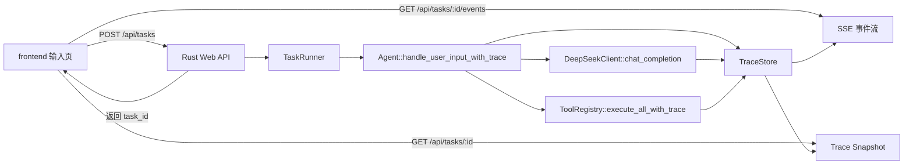

# Sparrow Agent 前端调用过程可视化方案

状态：建议方案  
日期：2026-05-08  
适用项目：`sparrow_agent` / `frontend`

## 1. 背景

当前 `sparrow_agent` 的核心能力已经集中在 Rust CLI 中：

- `src/main.rs` 通过命令行读取用户输入。
- `src/agent.rs` 维护消息历史，驱动模型调用和工具调用循环。
- `src/client.rs` 调用 DeepSeek Chat Completion。
- `src/tool_registry.rs` 分发并执行本地工具和 MCP 工具。
- `frontend/` 是 Vite + React + Tailwind 初始项目，目前只有一个静态标题。

目标是在 `frontend` 中提供一个可视化界面：初始态是输入框，用户提交任务后，前端通过 HTTP 请求把任务发送到 agent 端。任务启动后，用户可以切换到“调用过程”视图，看到模型调用、工具调用、工具返回、最终回答等节点；点击任意节点后，可以查看该节点的详细输入、输出、耗时、状态和元信息。

## 2. 总体目标

本方案落地后应支持以下能力：

- 前端首屏直接提供任务输入框和发送按钮。
- 发送任务后，后端立即返回 `task_id`，任务在后台异步执行。
- 前端可以通过 HTTP SSE 订阅该任务的 trace 事件，也可以通过 snapshot 接口做重连恢复。
- 调用过程视图以节点图或时间线展示 agent 内部执行过程。
- 节点类型至少包含用户输入、模型调用、工具调用、工具结果、最终回答、错误。
- 点击节点后展示结构化详情，包括输入、输出、状态、耗时、token usage、模型名、工具名、工具参数等。
- 不改变现有 CLI 的基本使用方式；Web Server 作为新增入口。

## 3. 非目标

第一版不做以下事情：

- 不实现多用户鉴权和权限系统。
- 不把 trace 持久化到数据库，先使用进程内存保存最近任务。
- 不强制改造为 WebSocket；SSE 已足够承载后端到前端的单向事件流。
- 不一开始引入复杂图编辑器。第一版可以用 React + CSS 实现稳定时间线，后续再引入 React Flow 类图库。
- 不把所有原始请求和工具输出无限制暴露给前端。详情需要有长度上限和敏感字段脱敏。

## 4. 目标架构



核心设计是新增一条 `TraceEmitter` 事件链路。Agent 仍然负责模型与工具循环，但每个关键阶段都会发出结构化事件。后端把事件写入 `TraceStore`，同时广播给正在监听的前端。

## 5. 后端接口设计

### 5.1 启动任务

```http
POST /api/tasks
Content-Type: application/json
```

请求：

```json
{
  "input": "帮我分析这个项目的结构",
  "session_id": null
}
```

响应：

```json
{
  "task_id": "task_01hy...",
  "status": "running",
  "events_url": "/api/tasks/task_01hy.../events"
}
```

实现建议：

- 使用 `axum` 增加 Web Server。
- 每次请求创建一个 `TaskRunner`，在 `tokio::spawn` 中后台运行。
- 第一版每个 task 使用一个新的 `Agent` 实例，避免多个浏览器任务共享消息历史。
- 如果后续需要多轮 Web 会话，再通过 `session_id` 复用 `AgentSession`。

### 5.2 订阅事件

```http
GET /api/tasks/:task_id/events
Accept: text/event-stream
```

服务端通过 SSE 持续推送：

```text
event: trace
data: {"seq":1,"task_id":"task_01hy...","type":"task_started",...}

event: trace
data: {"seq":2,"task_id":"task_01hy...","type":"node_started",...}

event: trace
data: {"seq":3,"task_id":"task_01hy...","type":"node_finished",...}
```

前端使用 `EventSource` 消费事件。SSE 断开时，前端通过 snapshot 接口拉取当前完整状态，然后重新连接。

### 5.3 查询快照

```http
GET /api/tasks/:task_id
```

响应：

```json
{
  "task_id": "task_01hy...",
  "status": "running",
  "input": "帮我分析这个项目的结构",
  "created_at": "2026-05-08T12:00:00Z",
  "updated_at": "2026-05-08T12:00:03Z",
  "nodes": [],
  "edges": [],
  "final_answer": null,
  "error": null
}
```

这个接口用于：

- 刷新页面后恢复 trace。
- SSE 断线后补状态。
- 任务完成后查看完整结果。

## 6. Trace 数据模型

建议新增 `src/trace.rs`：

```rust
#[derive(Debug, Clone, Serialize, Deserialize)]
pub struct TraceRun {
    pub task_id: String,
    pub status: TraceStatus,
    pub input: String,
    pub created_at: String,
    pub updated_at: String,
    pub nodes: Vec<TraceNode>,
    pub edges: Vec<TraceEdge>,
    pub final_answer: Option<String>,
    pub error: Option<String>,
}

#[derive(Debug, Clone, Serialize, Deserialize)]
pub struct TraceNode {
    pub id: String,
    pub kind: TraceNodeKind,
    pub label: String,
    pub status: TraceStatus,
    pub round: Option<usize>,
    pub parent_id: Option<String>,
    pub started_at: Option<String>,
    pub finished_at: Option<String>,
    pub duration_ms: Option<u64>,
    pub summary: Option<String>,
    pub input: Option<serde_json::Value>,
    pub output: Option<serde_json::Value>,
    pub metadata: serde_json::Value,
}

#[derive(Debug, Clone, Serialize, Deserialize)]
pub struct TraceEdge {
    pub from: String,
    pub to: String,
    pub label: Option<String>,
}

#[derive(Debug, Clone, Serialize, Deserialize)]
#[serde(rename_all = "snake_case")]
pub enum TraceNodeKind {
    UserInput,
    ModelCall,
    ToolCall,
    ToolResult,
    AssistantMessage,
    Error,
}

#[derive(Debug, Clone, Serialize, Deserialize)]
#[serde(rename_all = "snake_case")]
pub enum TraceStatus {
    Pending,
    Running,
    Completed,
    Failed,
}
```

事件模型：

```rust
#[derive(Debug, Clone, Serialize, Deserialize)]
#[serde(tag = "type", rename_all = "snake_case")]
pub enum TraceEvent {
    TaskStarted { run: TraceRun },
    NodeStarted { node: TraceNode },
    NodeUpdated { node_id: String, patch: serde_json::Value },
    NodeFinished { node_id: String, output: Option<serde_json::Value>, metadata: serde_json::Value },
    EdgeAdded { edge: TraceEdge },
    TaskFinished { final_answer: String },
    TaskFailed { error: String },
}
```

### 6.1 节点内容约定

模型调用节点：

- `label`: `Model: deepseek-v4-flash`
- `input`: `model`、`messages` 摘要、`tools_count`、`thinking`、`reasoning_effort`
- `output`: `content`、`reasoning_content`、`tool_calls`、`finish_reason`
- `metadata`: `usage`、`round`、`request_id`

工具调用节点：

- `label`: `Tool: webSearch`
- `input`: `tool_call_id`、`name`、`arguments`
- `output`: 工具返回内容或错误
- `metadata`: `provider`、`duration_ms`、`result_size`

最终回答节点：

- `label`: `Final answer`
- `input`: 最后一轮 assistant message 摘要
- `output`: 最终回答文本

## 7. 后端改造点

### 7.1 新增 Web Server

建议新增文件：

- `src/server.rs`
- `src/trace.rs`
- `src/task_runner.rs`
- `src/bin/server.rs`

建议新增依赖：

```toml
axum = "0.8"
tower-http = { version = "0.6", features = ["cors", "trace"] }
tokio-stream = "0.1"
uuid = { version = "1", features = ["v7", "serde"] }
chrono = { version = "0.4", features = ["serde"] }
```

`src/bin/server.rs` 负责启动：

```text
cargo run --bin server
```

默认监听：

```text
127.0.0.1:3001
```

### 7.2 Agent 增加 trace 入口

保留现有：

```rust
pub async fn handle_user_input(&mut self, input: impl Into<String>) -> Result<()>
```

新增：

```rust
pub async fn handle_user_input_with_trace(
    &mut self,
    input: impl Into<String>,
    trace: TraceEmitter,
) -> Result<String>
```

区别：

- 返回最终回答字符串，便于 HTTP API 返回和保存。
- 在用户输入、每轮模型调用、工具调用、最终回答、错误处发事件。
- 内部逻辑尽量复用现有 `build_request()` 和 `handle_assistant_message()`。

关键事件位置：

```text
handle_user_input_with_trace
  -> emit user_input node
  -> for round in max_tool_rounds
      -> build_request()
      -> emit model_call started
      -> client.chat_completion()
      -> emit model_call finished
      -> if tool_calls
          -> emit assistant/tool-call edge
          -> tool_registry.execute_all_with_trace()
          -> append tool messages
          -> continue
      -> else
          -> emit final answer
          -> return answer
```

### 7.3 ToolRegistry 增加结构化执行结果

当前 `ToolExecutionResult` 只有：

```rust
pub struct ToolExecutionResult {
    pub tool_call_id: String,
    pub content: String,
}
```

建议扩展为：

```rust
pub struct ToolExecutionResult {
    pub tool_call_id: String,
    pub tool_name: String,
    pub arguments: String,
    pub content: String,
    pub status: TraceStatus,
    pub error: Option<String>,
    pub duration_ms: u64,
}
```

同时新增：

```rust
pub async fn execute_all_with_trace(
    &self,
    tool_calls: &[ToolCall],
    trace: &TraceEmitter,
    parent_node_id: &str,
) -> Vec<ToolExecutionResult>
```

这样前端可以准确知道每个工具节点的名称、参数、结果和耗时。

### 7.4 TraceStore 与广播

建议使用内存存储：

```rust
type SharedTraceStore = Arc<RwLock<HashMap<String, TraceRun>>>;
```

每个任务维护一个 `broadcast::Sender<TraceEventEnvelope>`：

```rust
pub struct TraceEventEnvelope {
    pub seq: u64,
    pub task_id: String,
    pub event: TraceEvent,
}
```

`TraceEmitter` 同时做两件事：

- 修改 `TraceStore` 中的快照。
- 通过 `broadcast` 推送事件给 SSE 连接。

第一版可以只保留最近 100 个任务或最近 24 小时任务，避免内存无限增长。

## 8. 前端设计

当前前端是 React 19 + Tailwind 4。第一版建议保持依赖简单，不马上引入大型图编辑库。

### 8.1 页面状态

```ts
type AppMode = 'input' | 'result'
type TraceTab = 'chat' | 'trace'
type TaskStatus = 'pending' | 'running' | 'completed' | 'failed'
```

核心状态：

```ts
type TraceRun = {
  task_id: string
  status: TaskStatus
  input: string
  nodes: TraceNode[]
  edges: TraceEdge[]
  final_answer?: string
  error?: string
}

type TraceNode = {
  id: string
  kind: 'user_input' | 'model_call' | 'tool_call' | 'tool_result' | 'assistant_message' | 'error'
  label: string
  status: TaskStatus
  round?: number
  summary?: string
  input?: unknown
  output?: unknown
  metadata?: unknown
}
```

### 8.2 首屏输入

初始态：

- 居中输入框。
- 支持 Enter 发送，Shift+Enter 换行。
- 发送按钮在输入为空时 disabled。
- 发送后进入 result 模式，默认展示“对话”或“调用过程”均可；建议默认展示“调用过程”，让用户立即看到任务在跑。

### 8.3 结果页布局

建议三栏或两栏布局：

```text
顶部：任务输入摘要 / 状态 / 重新运行按钮

左侧：Tab
  - 对话
  - 调用过程

中间：调用过程节点时间线或图
右侧：选中节点详情面板
```

第一版节点视图可以是垂直时间线：

```text
User input
  ↓
Model round 0
  ↓
Tool: webSearch
  ↓
Model round 1
  ↓
Final answer
```

如果一轮模型返回多个工具调用，可以在同一 round 下横向并列展示工具节点。

后续如果需要可拖拽、缩放、布局更复杂的 DAG，再引入 `@xyflow/react`。

### 8.4 节点详情面板

点击节点后，右侧展示：

- 标题：节点 label、类型、状态。
- 基础信息：round、开始时间、结束时间、耗时。
- 输入：JSON pretty view。
- 输出：JSON pretty view。
- 元信息：token usage、模型名、工具 provider、错误信息。

展示原则：

- 长文本默认折叠，提供展开。
- JSON 需要等宽字体和可复制按钮。
- 错误节点使用明显但克制的颜色。
- `reasoning_content` 若展示，需要单独分区，避免和最终回答混在一起。

## 9. 前端数据流

### 9.1 提交任务

```ts
async function submitTask(input: string) {
  const response = await fetch('/api/tasks', {
    method: 'POST',
    headers: { 'Content-Type': 'application/json' },
    body: JSON.stringify({ input }),
  })

  const task = await response.json()
  setTaskId(task.task_id)
  subscribeTrace(task.task_id)
}
```

### 9.2 订阅 SSE

```ts
function subscribeTrace(taskId: string) {
  const source = new EventSource(`/api/tasks/${taskId}/events`)

  source.addEventListener('trace', (message) => {
    const envelope = JSON.parse(message.data)
    applyTraceEvent(envelope.event)
  })

  source.onerror = async () => {
    source.close()
    const snapshot = await fetch(`/api/tasks/${taskId}`).then((r) => r.json())
    setTraceRun(snapshot)
  }
}
```

### 9.3 Vite 代理

`frontend/vite.config.ts` 增加代理，开发时让前端请求转发到 Rust server：

```ts
export default defineConfig({
  plugins: [react(), tailwindcss()],
  server: {
    proxy: {
      '/api': 'http://127.0.0.1:3001',
    },
  },
})
```

## 10. 敏感信息与输出限制

节点详情要展示输入输出，但不能无边界地暴露敏感内容。建议规则：

- 请求 header、API key、环境变量永远不进入 trace。
- system prompt 默认只显示摘要或长度；需要调试时通过配置开启完整展示。
- 单个节点 `input` / `output` 默认限制 64 KiB。
- 超限时保存截断标记：

```json
{
  "truncated": true,
  "original_bytes": 183245,
  "preview": "..."
}
```

- 工具结果如果是文件内容，优先展示摘要和路径，完整内容后续再接入 artifact store。

## 11. 推荐落地步骤

### 第一步：后端 trace 基础设施

- 新增 `trace.rs`，定义 `TraceRun`、`TraceNode`、`TraceEvent`。
- 新增 `TraceStore` 和 `TraceEmitter`。
- 给 `Agent` 增加 `handle_user_input_with_trace()`。
- 在模型调用前后发 `model_call` 节点事件。
- 在最终回答处发 `assistant_message` 和 `task_finished` 事件。

验收标准：

- 不启动前端时，可以通过测试或日志看到完整 trace event。
- 现有 CLI `cargo run` 行为不变。

### 第二步：工具 trace

- 扩展 `ToolExecutionResult`，记录工具名、参数、状态、耗时、错误。
- 新增 `execute_all_with_trace()`。
- 每个工具调用生成一个 `tool_call` 节点。
- 工具失败也作为节点输出展示，而不是只拼成字符串。

验收标准：

- webSearch、runRustWasm、MCP filesystem 工具都能在 trace 中出现。
- 多工具调用时节点顺序和 round 关系清晰。

### 第三步：HTTP API 与 SSE

- 新增 `src/server.rs` 和 `src/bin/server.rs`。
- 实现 `POST /api/tasks`、`GET /api/tasks/:id/events`、`GET /api/tasks/:id`。
- 增加 CORS 或 Vite proxy。
- 限制内存中任务保留数量。

验收标准：

- `curl -X POST /api/tasks` 能返回 `task_id`。
- 浏览器可以持续收到 SSE trace 事件。
- 任务完成后 snapshot 中有完整 nodes 和 final answer。

### 第四步：前端输入与任务状态

- 改造 `frontend/src/App.tsx`，实现输入框、发送、任务状态。
- 增加 API client：`submitTask()`、`subscribeTrace()`、`fetchSnapshot()`。
- 增加 Vite proxy。
- 用 Tailwind 完成基础布局。

验收标准：

- 用户可以从首屏输入任务并发送。
- 发送后页面进入运行态，并显示任务状态。

### 第五步：调用过程视图

- 实现 `TraceTimeline` 组件展示节点。
- 实现 `TraceNodeCard` 组件展示状态、类型、摘要。
- 实现 `TraceDetailsPanel` 展示选中节点输入输出。
- 实现 Tab：`对话` / `调用过程`。

验收标准：

- 模型调用和工具调用能实时出现在页面上。
- 点击节点可以看到该节点详细输入输出。
- 任务失败时 UI 显示错误节点和错误详情。

### 第六步：体验与可靠性增强

- SSE 断线后自动 snapshot 恢复。
- 长文本折叠、复制、JSON 格式化。
- 对 `reasoning_content` 单独展示。
- 增加空态、加载态、失败态。
- 补充后端单元测试和前端组件测试。

## 12. 测试计划

后端：

- `cargo test` 覆盖 `TraceStore` 事件合并逻辑。
- 测试模型调用成功时会生成 `model_call` 和 `assistant_message` 节点。
- 测试工具调用成功、失败时节点状态正确。
- 测试 SSE 能发送已有事件和后续事件。

前端：

- `pnpm lint` 检查代码风格。
- `pnpm build` 验证类型和构建。
- 使用模拟 SSE 事件测试 `applyTraceEvent()`。
- 手工验证：
  - 输入任务并发送。
  - 切换“调用过程”。
  - 点击模型节点查看 request / response。
  - 点击工具节点查看 arguments / result。
  - 刷新页面后通过 snapshot 恢复。

## 13. 后续演进

第一版跑通后，可以继续增强：

- 接入 `docs/streaming-thinking-display-plan.md` 中的流式 reasoning，把模型思考和回答增量也作为节点更新事件推送。
- 引入 `@xyflow/react` 做可缩放 DAG，适合复杂并行工具调用。
- 增加任务历史列表和本地持久化。
- 增加 artifact store，支持超大工具输出的分页查看。
- 增加多轮 session，让前端成为完整对话界面。
- 增加 OpenTelemetry / tracing，把 trace 同时输出到日志系统。

## 14. 推荐文件变更清单

后端：

```text
Cargo.toml
src/lib.rs
src/trace.rs
src/server.rs
src/task_runner.rs
src/bin/server.rs
src/agent.rs
src/tool_registry.rs
```

前端：

```text
frontend/vite.config.ts
frontend/src/App.tsx
frontend/src/index.css
frontend/src/api.ts
frontend/src/types.ts
frontend/src/components/PromptComposer.tsx
frontend/src/components/TraceTimeline.tsx
frontend/src/components/TraceNodeCard.tsx
frontend/src/components/TraceDetailsPanel.tsx
frontend/src/components/JsonBlock.tsx
```

## 15. 推荐优先级

建议先做“可观察性闭环”，再做视觉精修：

1. 后端 trace event 能完整表达一次 Agent 运行。
2. HTTP API 能启动任务并推送事件。
3. 前端能实时显示节点和详情。
4. 再优化布局、动效、复杂图形和持久化。

这样可以尽快验证最关键的事情：前端看到的每个节点都来自 agent 端真实执行过程，而不是前端推测出来的 UI 状态。
