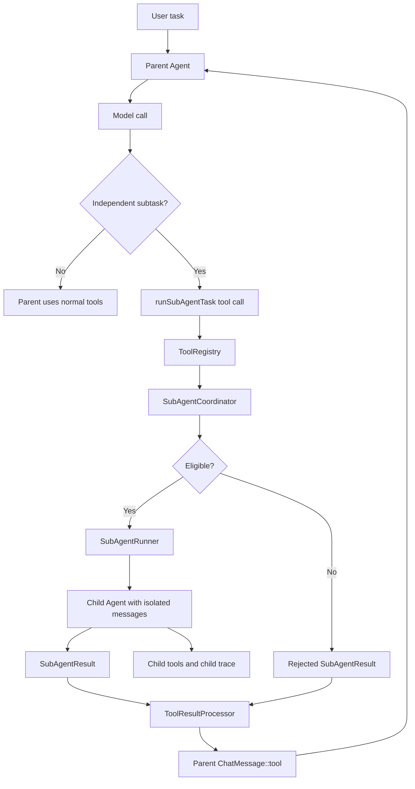

# 子 Agent 能力设计方案

日期：2026-05-20
状态：草案

## 背景

当前 Sparrow Agent 以会话级 `Agent` 维护完整 `messages`，每个 HTTP task 会通过 `ConversationStore` 获取对应会话的 `Agent`，再由 `Agent::handle_user_input_with_trace` 驱动模型调用、工具执行和 trace 事件写入。工具调用已经具备并行执行能力：同一轮模型返回的多个 tool call 会经 `ToolRegistry::execute_all_traced` 并发执行，再把每个 `ToolExecutionResult.content` 追加为 `ChatMessage::tool(...)`，供下一轮模型读取。

用户希望增加“子 agent”能力：当一个任务可以独立于当前上下文执行时，使用子 agent 完成；主 agent 只获取子 agent 返回的结果，不读取子 agent 的内部消息、工具轨迹或中间推理。

这类能力适合当前架构，因为 Sparrow 已经有：

- `Agent`：封装模型循环、消息历史和工具调用。
- `ToolProvider` / `ToolRegistry`：统一暴露和执行工具。
- `TraceStore` / `TraceSink`：按 task 记录结构化事件，并支持 SSE replay。
- `ToolResultProcessor`：对大工具输出做截断、落盘和元数据记录。
- `ConversationStore`：保证同一主会话同一时间只有一个 running task。

现有缺口是：所有模型工作都发生在同一个 `Agent.messages` 中。即使某个子问题完全可独立完成，当前也只能把全部探索过程写回主对话历史，增加上下文压力并污染主 agent 的思路。

## 目标

1. 增加可由主 agent 调用的子 agent 执行能力。
2. 当子任务满足独立性条件时，让子 agent 使用独立 `Agent`、独立 `messages` 和独立执行循环完成任务。
3. 主 agent 只接收子 agent 的结构化最终结果，并把它作为一条普通 tool result 追加到主 `messages`。
4. 子 agent 的 trace 与主任务建立父子关联，但不把子 agent 全量事件注入父 trace 或主上下文。
5. 复用现有工具协议、trace、工具输出后处理和配置边界，避免新增一条平行执行体系。
6. 保持 CLI、Server 和前端观察能力稳定；子 agent 能力应是增量能力。

非目标：

- 不让子 agent 共享或修改主 agent 的 `messages`。
- 不在第一阶段实现任意层级无限递归 agent。默认最多一层子 agent，后续可配置扩展。
- 不把子 agent 变成绕过审批、安全策略或 Server 模式限制的后门。
- 不要求主 agent 暴露或总结子 agent 的隐藏推理。主 agent 只消费显式返回的结果。
- 不在第一阶段实现复杂的跨 agent 工作队列、取消、恢复和资源抢占。

## 推荐方案

首选方案：把子 agent 建成一个特殊 `ToolProvider`，向模型暴露 `runSubAgentTask` 工具。主 agent 判断某个子任务可以独立执行时，调用该工具；`ToolRegistry` 像执行普通工具一样执行它；`SubAgentToolProvider` 内部创建独立 `SubAgentRunner`，运行一个临时 `Agent`，最后返回 `SubAgentResult` JSON。

推荐调用链：

```text
Agent::handle_assistant_message_with_trace
  -> ToolRegistry::execute_all_traced
      -> SubAgentToolProvider::execute(runSubAgentTask)
          -> SubAgentCoordinator::check_eligibility
          -> SubAgentRunner::run
              -> Agent::new(sub_config)
              -> Agent::handle_user_input_with_trace(sub_prompt, child_sink)
              -> child TraceStore task or child trace namespace
          -> SubAgentResult JSON
      -> ToolResultProcessor
  -> ChatMessage::tool(sub_agent_result_json, parent_tool_call_id)
  -> next model round
```

这样主 agent 无需知道子 agent 内部如何探索。对主 agent 来说，子 agent 只是一个返回高质量结果的工具；对运行时来说，子 agent 是一个独立 agent loop。

## 方案对比

### 方案 A：子 agent 作为 ToolProvider

优点：

- 最贴合当前架构，改动集中在 `ToolRegistry`、`Agent` 初始化和新增 `sub_agent.rs`。
- 天然满足“主 agent 仅获取结果”：工具协议只回填 `ToolExecutionResult.content`。
- 能复用 `execute_all_traced` 的并发能力，多个独立子任务可以并行执行。
- 能复用 `ToolResultProcessor` 对过长结果做截断和 artifact 保存。
- 前端仍按现有 tool call 节点展示父任务，只需在 payload 中增加 `child_task_id` 等关联字段。

缺点：

- 模型需要学会何时调用 `runSubAgentTask`。
- 如果工具定义过宽，模型可能把不该独立的任务也派给子 agent，需要 Host 侧 eligibility guard。

结论：推荐采用。

### 方案 B：Server 层预判并直接创建子任务

优点：

- Host 可以在收到用户请求前做调度，模型无需显式调用子 agent 工具。

缺点：

- Server 层看不到主 agent 每轮推理出的具体子任务，也无法自然融入 tool call 协议。
- 容易与 `ConversationStore` 的会话 busy 逻辑缠在一起。
- 主 agent 难以把子 agent 结果纳入下一轮模型调用。

结论：不推荐作为第一阶段。

### 方案 C：在 `Agent` 内部直接分叉子 `Agent`

优点：

- 不需要新增工具定义。

缺点：

- `Agent` 会承担调度、执行、结果转换和 trace 关联等多重职责。
- 难以复用现有工具并发与后处理路径。
- 更容易误把子 agent 内部状态写回主 `messages`。

结论：只作为后续优化，不作为第一版入口。

## 独立性判断

“可以独立于当前上下文执行”的任务必须同时满足以下条件：

1. **目标自包含**：子任务描述本身足够明确，子 agent 不需要读取主 agent 的完整历史才能开始。
2. **依赖显式化**：如果需要背景信息，主 agent 必须把必要事实、路径、约束或验收标准显式写进 `context_pack`。
3. **结果可合并**：子 agent 的输出可以作为一段结论、列表、JSON、patch 建议或 artifact 引用被主 agent 消费，不要求共享中间状态。
4. **无即时用户交互**：子任务执行过程中不需要向用户追问，也不需要主 agent 的下一步判断。
5. **资源边界清晰**：子任务的工具权限、最大轮数、超时和输出预算可以提前确定。
6. **失败可隔离**：子任务失败不会破坏主任务；主 agent 可以拿到失败摘要后自行降级处理。

适合派给子 agent 的任务：

- 只读代码库调研，例如“阅读这几个模块并总结插入点”。
- 多个互不依赖的测试失败根因分析。
- 搜索、资料整理、候选方案比较。
- 对单一文件或单一子系统的局部修复建议。
- 长输出工具结果的二次摘要。

不适合派给子 agent 的任务：

- 依赖当前对话中大量隐含偏好或尚未确认的用户意图。
- 需要实时确认、审批或选择的问题。
- 会修改与主 agent 或其他子 agent 相同文件的任务，除非后续引入明确的写集合锁。
- 需要主 agent 连续观察中间步骤才能决定下一步的任务。
- 高风险本地命令、凭据处理、系统配置修改。

## 工具定义

新增工具名：

```text
runSubAgentTask
```

建议描述：

```text
Run a self-contained sub-agent task in an isolated message context. Use this only when the task can be completed independently from the current conversation after the required context is provided explicitly. The parent agent receives only the final structured result.
```

参数 schema：

```json
{
  "type": "object",
  "properties": {
    "task": {
      "type": "string",
      "description": "The exact self-contained task for the sub-agent."
    },
    "context_pack": {
      "type": "string",
      "description": "Only the facts, file paths, constraints, and acceptance criteria required to complete the task."
    },
    "expected_output": {
      "type": "string",
      "description": "The required result format, for example summary, JSON, findings list, implementation notes, or artifact references."
    },
    "allowed_tools": {
      "type": "array",
      "items": { "type": "string" },
      "description": "Optional narrow list of tools the sub-agent may use. Empty means use the configured sub-agent default."
    },
    "max_tool_rounds": {
      "type": ["integer", "null"],
      "minimum": 1,
      "maximum": 20,
      "description": "Optional stricter maximum tool rounds for this subtask."
    }
  },
  "required": ["task", "context_pack", "expected_output"],
  "additionalProperties": false
}
```

第一阶段建议默认 `max_tool_rounds = min(parent.max_tool_rounds, 8)`，防止子 agent 长时间占用资源。

## 组件设计

### SubAgentToolProvider

新增模块建议：`src/sub_agent.rs`。

职责：

- 实现 `ToolProvider`。
- 注册 `runSubAgentTask` 工具定义。
- 解析工具参数。
- 调用 `SubAgentCoordinator` 判断 eligibility。
- 调用 `SubAgentRunner` 执行子任务。
- 把 `SubAgentResult` 序列化为 JSON 字符串返回给 `ToolRegistry`。

该 provider 应在 `Agent::new` 中注册到 `ToolRegistry`，顺序建议放在 `LocalToolProvider` 之后、MCP provider 之前或之后均可；关键是工具名唯一。

### SubAgentCoordinator

职责：

- 检查 `task`、`context_pack`、`expected_output` 是否为空。
- 检查 `context_pack` 是否显式包含必要上下文，而不是类似“见上文”“按我们刚才说的”这种依赖父会话的引用。
- 检查 `allowed_tools` 是否在配置允许范围内。
- 检查递归深度、并发数、超时和最大轮数。
- 生成派生 `conversation_id`、`client_message_id` 和可选 `child_task_id`。

eligibility 失败时不启动子 agent，直接返回结构化失败结果，主 agent 决定是否自己完成：

```json
{
  "status": "rejected",
  "reason": "context_pack depends on parent conversation instead of explicit facts",
  "final_answer": "",
  "child_task_id": null
}
```

### SubAgentRunner

职责：

- 创建独立 `Agent::new(sub_config)`。
- 构造子 agent system prompt，强调只执行给定任务、只返回指定格式、不要请求父上下文。
- 构造子 agent 用户消息：

```text
Task:
<task>

Context pack:
<context_pack>

Expected output:
<expected_output>
```

- 使用独立 trace sink 执行 `handle_user_input_with_trace`。
- 返回 `SubAgentResult`。

关键约束：

- 子 agent 不接收父 agent 的 `messages.clone()`。
- 子 agent 不写入父 agent 的 `messages`。
- 子 agent 默认不进入 `ConversationStore.running_tasks`，避免与主会话 busy 锁互相阻塞。

### SubAgentResult

建议 JSON 结构：

```json
{
  "status": "succeeded",
  "final_answer": "子 agent 的最终结论。",
  "summary": "面向主 agent 的短摘要。",
  "child_task_id": "task_01...",
  "child_conversation_id": "conv_sub_01...",
  "artifact_refs": [],
  "usage": {
    "model": "deepseek-v4-pro",
    "rounds": 3
  },
  "warnings": []
}
```

失败时：

```json
{
  "status": "failed",
  "final_answer": "",
  "summary": "子 agent 未能完成任务。",
  "child_task_id": "task_01...",
  "child_conversation_id": "conv_sub_01...",
  "artifact_refs": [],
  "usage": {
    "model": "deepseek-v4-pro",
    "rounds": 2
  },
  "warnings": ["reached max tool rounds"]
}
```

`ToolResultProcessor` 仍会处理该 JSON 字符串。如果 `final_answer` 过长，完整结果落盘，主 agent 收到摘要、预览和 artifact path。

### SubAgentTraceSink

第一阶段推荐让子 agent 使用独立 `TraceStore` task，而不是把所有子事件写进父 trace。

父 trace 中保留：

- `tool_call.started`：名称为 `runSubAgentTask`，参数包含子任务摘要。
- `tool_call.completed`：输出包含 `SubAgentResult`，payload 可增加 `child_task_id`、`child_conversation_id`。

子 trace 中保留完整模型调用和工具调用事件，并在 `task.started` payload 中增加父关联：

```json
{
  "message": {
    "role": "user",
    "content": "..."
  },
  "parent": {
    "task_id": "task_parent",
    "tool_call_id": "call_abc",
    "parent_model_output_id": "output_abc"
  }
}
```

这样前端可以从父工具节点跳转到子任务详情，但父任务不会被子 agent 的流式 delta 撑爆。

## 配置

新增配置建议：

```rust
pub struct SubAgentConfig {
    pub enabled: bool,
    pub max_depth: usize,
    pub max_concurrent: usize,
    pub max_tool_rounds: usize,
    pub timeout_ms: u64,
    pub allowed_tools: Vec<String>,
    pub inherit_filesystem: bool,
    pub inherit_bash: bool,
}
```

环境变量建议：

| 变量 | 默认值 | 说明 |
| --- | --- | --- |
| `SPARROW_SUB_AGENT_ENABLED` | `true` | 是否暴露 `runSubAgentTask` |
| `SPARROW_SUB_AGENT_MAX_DEPTH` | `1` | 子 agent 最大递归深度 |
| `SPARROW_SUB_AGENT_MAX_CONCURRENT` | `3` | 单个父任务可并行子 agent 数 |
| `SPARROW_SUB_AGENT_MAX_TOOL_ROUNDS` | `8` | 子 agent 默认最大工具轮数 |
| `SPARROW_SUB_AGENT_TIMEOUT_MS` | `120000` | 单个子任务超时 |
| `SPARROW_SUB_AGENT_ALLOWED_TOOLS` | `webSearch,mcp__filesystem__read_file,mcp__filesystem__search_files` | 默认允许工具集合 |
| `SPARROW_SUB_AGENT_INHERIT_BASH` | `false` | 是否允许继承 Bash 工具 |

Server 模式当前会调用 `AppConfig::without_interactive_tools()` 禁用交互式 Bash。子 agent 必须继承这个收窄后的配置，不允许重新打开 Bash。

## 安全与隔离

1. **上下文隔离**：子 agent 只接收 `task` 和 `context_pack`，不接收父 `messages`。
2. **工具隔离**：子 agent 的工具集合取父配置与 `allowed_tools` 的交集。
3. **递归限制**：第一阶段子 agent 不再暴露 `runSubAgentTask` 给自己的子 `ToolRegistry`，或通过 `max_depth = 1` 拒绝递归。
4. **并发限制**：`SubAgentCoordinator` 使用 semaphore 限制每个父任务和全局子 agent 并发数。
5. **超时限制**：子 agent 执行包裹 `tokio::time::timeout`。
6. **输出限制**：所有子 agent 结果仍经过 `ToolResultProcessor`。
7. **审批限制**：子 agent 不绕过 filesystem、bash、MCP provider 的现有 root、denylist、confirm 和 mode 设置。

## 错误处理

错误分四类：

| 类型 | 行为 |
| --- | --- |
| eligibility rejected | 返回 `status = "rejected"`，不创建子 task |
| child agent failed | 返回 `status = "failed"` 和错误摘要，父 task 继续 |
| child timeout | 返回 `status = "timeout"`，包含已知 child task id |
| provider internal error | 走现有 `Tool execution failed: ...` 路径，并写 `tool_call.failed` |

推荐让 eligibility rejected、child failed、timeout 都作为“工具成功返回的结构化失败结果”，而不是直接让父工具调用失败。这样主 agent 可以根据失败原因选择自己完成任务或换更小的子任务。

## 数据流



主 agent 的上下文只看到 `SubAgentResult`；子 agent 的内部消息、工具结果和 trace 只存在于 child task 或 artifact 中。

## 需要修改的文件

建议文件边界：

| 文件 | 修改 |
| --- | --- |
| `src/sub_agent.rs` | 新增 `SubAgentToolProvider`、`SubAgentCoordinator`、`SubAgentRunner`、参数和结果类型 |
| `src/config.rs` | 新增 `SubAgentConfig` 和环境变量读取 |
| `src/agent.rs` | 在 `Agent::new` 构造 `ToolRegistry` 时注册 `SubAgentToolProvider` |
| `src/lib.rs` | 暴露 `sub_agent` 模块 |
| `src/tool_registry.rs` | 可选：在 traced tool completed payload 中允许 provider 附加 child task metadata |
| `src/trace.rs` | 可选：不新增 event type，优先通过 payload 增加 parent/child 关联 |
| `src/trace_store.rs` | 可选：支持按 parent task 查询 child task，第一阶段可不做 |
| `tests/sub_agent_contract.rs` | 新增子 agent 行为契约测试 |
| `tests/server_contract.rs` | 补充主会话 busy 与子 agent 不互相阻塞的测试 |

## 测试计划

### 单元测试

- `SubAgentCoordinator` 接受自包含任务。
- `SubAgentCoordinator` 拒绝空 `task`、空 `expected_output`、空 `context_pack`。
- `SubAgentCoordinator` 拒绝含“见上文”“按刚才讨论”的隐式上下文依赖。
- `SubAgentCoordinator` 正确限制 `max_tool_rounds`、`max_depth` 和 `allowed_tools`。
- `SubAgentResult` 成功、失败、拒绝、超时都能稳定序列化。

### 契约测试

新增 `tests/sub_agent_contract.rs`：

- 子 agent 创建独立 `Agent`，不复用父 `messages`。
- `runSubAgentTask` 返回结构化 JSON，父 agent 只追加一条 `ChatMessage::tool`。
- 子 agent 失败时父任务不自动失败。
- 子 agent 结果过长时走 `ToolResultProcessor` 截断和 artifact 保存。

扩展 `tests/server_contract.rs`：

- 主 conversation 正在 running 时，外部第二个主 task 仍返回 `conversation_busy`。
- 主 task 内部启动子 agent 不触发同 conversation 的 busy 锁。

扩展 trace 相关测试：

- 父 `tool_call.completed` payload 包含 `child_task_id`。
- 子 `task.started` payload 包含 parent 关联。
- 子 trace 事件量不会计入父 task 的 event limit。

## 分阶段落地

### 阶段 1：最小可用子 agent 工具

- 新增 `SubAgentConfig`。
- 新增 `SubAgentToolProvider`，注册 `runSubAgentTask`。
- 新增 `SubAgentRunner`，创建独立 `Agent` 并返回最终结果。
- 子 agent 默认禁用递归，默认不继承 Bash。
- 父 agent 只收到 `SubAgentResult`。

### 阶段 2：Trace 父子关联

- 子 agent 创建独立 child task。
- 父 trace 的工具节点记录 `child_task_id`。
- 子 trace 的 `task.started` 记录 parent metadata。
- 前端后续可增加从父工具节点跳转 child task 的交互。

### 阶段 3：更强的调度与资源控制

- 增加 per-parent 和 global semaphore。
- 增加 timeout、取消和任务清理。
- 支持多个独立子任务并发执行后的结果聚合。

### 阶段 4：更严格的上下文编译

- 与后续 `ContextCompiler` / `ArtifactStore` 结合。
- `context_pack` 可引用 artifact，而不是复制大段文本。
- 子 agent 输出可自动沉淀为 bounded observation。

## 风险与缓解

| 风险 | 缓解 |
| --- | --- |
| 模型滥用子 agent | 工具描述强调独立性，Host eligibility guard 拒绝隐式上下文依赖 |
| 主上下文被子过程污染 | 子 agent 不共享父 `messages`，父只接收 `SubAgentResult` |
| 子 agent 与主 conversation busy 锁死 | 子 agent 不进入父 `ConversationStore.running_tasks` |
| 事件量暴涨 | 子 trace 独立保存，父 trace 只保存工具级关联 |
| 资源耗尽 | 限制 depth、concurrency、timeout、max_tool_rounds |
| 安全策略绕过 | 子 config 取父 config 收窄版本，Server 模式不重新开启 interactive Bash |
| 结果过长 | 复用 `ToolResultProcessor` 截断和 artifact 保存 |

## 推荐结论

第一版应实现为 `runSubAgentTask` 工具和 `SubAgentToolProvider`。主 agent 通过模型工具调用表达“这个子任务可以独立执行”，Host 通过 `SubAgentCoordinator` 做硬性 eligibility 检查，子 agent 使用独立 `Agent` 完成任务，最终只把 `SubAgentResult` 作为 tool result 回填给主 agent。

这个方案改动小、边界清楚，并且直接满足核心要求：只要任务能独立于当前上下文执行，就交给子 agent；主 agent 仅获得子 agent 返回的结果。
